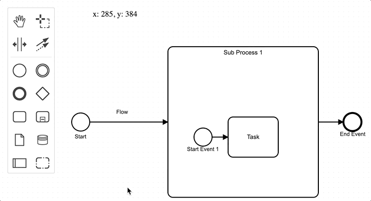

# diagram-js-cursor-debug

diagram-js extension which shows current local point on canvas.



## Installation

```sh
$ npm i --save diagram-js-cursor-debug
```

## Usage
```js
import BpmnModeler from 'bpmn-js/lib/Modeler';

import cursorDebugModule from 'diagram-js-cursor-debug';

var modeler = new BpmnModeler({
  // ...
  additionalModules: [
    cursorDebugModule
  ]
});

```

